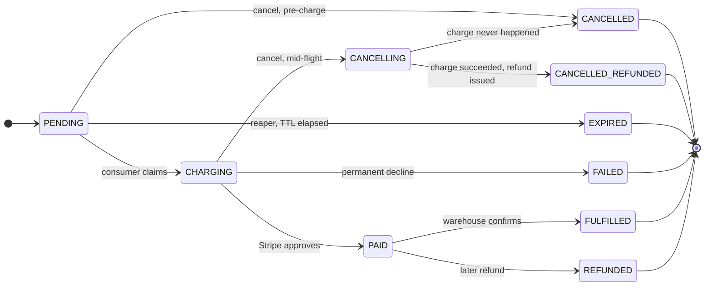
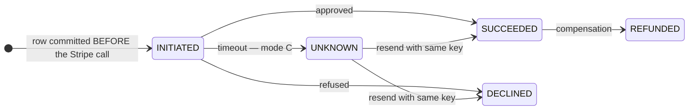
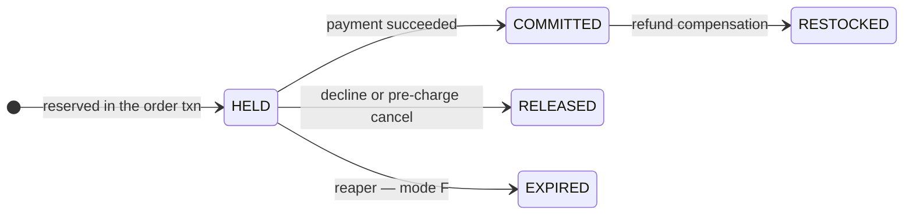
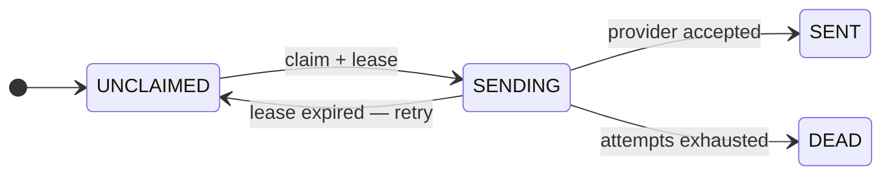

# Concurrent Order Processing System — Design Plan (TypeScript)

> **Status: DESIGN IN PROGRESS.** Nothing is being built. Working through failure modes
> pedagogically before locking architecture. Three structural decisions remain open.
>
> **Companion file:** `design-dialogue-transcript.md` — the chronological back-and-forth, with
> Ahmed's questions verbatim and the corrections made along the way. This file organizes
> conclusions by topic; that one preserves the order they were reached in.
>
> Citations of the form `README.md:212` refer to the assignment brief at the repository root
> (`../README.md`), by line number.

## Contents

1. [Context](#1-context)
2. [Decisions locked](#2-decisions-locked)
3. [Decisions open](#3-decisions-open)
4. [The ten failure modes](#4-the-ten-failure-modes)
5. [Session log](#5-session-log)
6. [Roadmap — remaining discussions](#6-roadmap--remaining-discussions)
7. [Spec gaps to decide deliberately](#7-spec-gaps-to-decide-deliberately)
8. [Verification plan](#8-verification-plan)
9. [Owed](#9-owed)

---

## 1. Context

`README.md` specifies a Go/GORM/Gin take-home: a concurrent order processing system with
inventory management, payment processing, notifications, and reporting. Ahmed has employer
permission to submit in TypeScript instead.

Stripped of Go vocabulary, the assignment reduces to four hard problems:

1. **Don't oversell** under concurrent purchase of the last unit
2. **Don't double-charge** when payments time out ambiguously
3. **Don't block** throughput on slow payment calls or heavy reports
4. **Stay consistent** when 1000 orders land at once

### The rubric problem

`README.md:212` grades Technical Implementation at 40%, and two of its four sub-bullets are
*"Proper use of Go idioms and patterns"* and *"GORM usage"*. Concurrency at 25% says
*"Effective use of goroutines and channels"* verbatim. Roughly a quarter of the rubric is
written in vocabulary that cannot be satisfied literally.

Equivalence must therefore be **argued and measured**, not assumed. A `DESIGN_DECISIONS.md`
with a Go↔TS mapping table and real benchmark numbers is load-bearing for ~25% of the grade,
not polish.

### The argument that defuses it

> The concurrency primitive was never the bottleneck. The database was.

1000 concurrent orders in Go spawn 1000 cheap goroutines — which immediately queue on a
~20-connection pool and serialize on a row lock for the hot product. Node hits that same wall
at the same place, with less memory per in-flight request. Goroutines buy nothing the pool
takes straight back.

Say it, then **prove it with a load test**. That benchmark is worth more than any prose.

### The rule that dictates the architecture

**Never hold a row lock across network I/O.** A payment call is 100ms–3s. Hold an inventory
lock across it and throughput on a hot product is 0.3–10 orders/sec in *any* language.

---

## 2. Decisions locked

| Decision | Choice | Rationale |
|---|---|---|
| Language | TypeScript | Permission granted; Go fluency was the limiting factor |
| Inventory strategy | Reserve → pay → commit | Never holds a row lock across the payment network call |
| Go-framing stance | Idiomatic Node + measured proof | Win on benchmarks, not on resemblance |
| Process model | Two entry points, one image | `dist/api.js` + `dist/worker.js`, scaled independently |
| State transitions | CAS updates everywhere | Mandatory — makes at-least-once delivery survivable |
| Inventory write | Atomic conditional `UPDATE` + rowcount, `CHECK (available >= 0)` | One statement, no read-write gap, no retry loop — §5.10 |
| Deadlock avoidance | Sort line items by `product_id`; bounded retry on `40P01` | Total order on resources makes wait-cycles impossible — §5.10 |
| **Queue substrate** | **Outbox → relay → RabbitMQ, for every async handoff** | Ahmed's call 2026-08-07: if the broker is in (bonus point, `README.md:259`), keep one mechanism rather than two. The outbox is non-negotiable either way — a broker never removes the table, it only adds to it (§5.12). Relay claims batches with `SKIP LOCKED` so two instances can't double-publish. |
| Scheduled work | Periodic loop in the worker process, **not** a consumer | A queue delivers "something happened." The reaper's trigger is *"Sarah still hasn't paid"* — the absence of an event is not an event. State this in the README so it doesn't read as an oversight. |

---

## 3. Decisions open

- **Pipeline shape** — sync / async (202 + worker) / hybrid. Leaning async: the spec lists
  `GET /orders/{id}/status` as separate from `GET /orders/{id}`, which only makes sense if state
  changes after creation returns. Also required to satisfy the mandatory "Background Jobs /
  job queue" bullet. Hybrid is *also* safe given CAS — see §5.4.
- **Job state visibility** — RabbitMQ is transport, not storage (§5.9), so once a message is consumed
  you cannot ask "what happened to order 1001's charge?" `GET /orders/{id}/status` is mandatory at
  `README.md:87`, so *some* table must record attempt/outcome state regardless. Open question is
  only whether that lives on `orders` itself or in a separate `payment_attempts` table.
- **CPU offload depth (failure mode H)** — SQL aggregation is settled. Open only on the residual
  CSV/PDF serialization: `worker_threads` with a before/after p99 benchmark, vs. simply running
  exports in the worker process. §5.8 shrank this considerably.
- Framework, ORM, real-time transport, Redis role, scope triage — all downstream of the above.

---

## 4. The ten failure modes

The territory is finite. Everything this system can get wrong:

| # | Failure | Cluster |
|---|---|---|
| A | Two customers buy the last item, both succeed → oversold | Inventory |
| B | Order saved, crash before job queued → stranded forever | Distributed |
| C | Payment times out, outcome unknown, retry → double charge | Distributed |
| D | Cancel arrives while payment in flight → charged a cancelled order | Distributed |
| E | Worker dies mid-job → stuck, or runs twice | Distributed |
| F | Customer abandons checkout → stock held hostage | Inventory |
| G | Two multi-item orders lock same products in opposite order → deadlock | Inventory |
| H | Report generation freezes the event loop → every order stalls | Node-specific |
| I | Notification sent twice, or never | Distributed |
| J | 1000 concurrent orders exhaust the DB connection pool | Node-specific |

---

## 5. Session log

### 5.1 Language choice — Go vs TypeScript

**Where Go is genuinely easier:** report generation (`go generateReport()` vs. a whole
`worker_threads` apparatus); structured concurrency (`errgroup.Group` with `SetLimit`,
`context.Context` threading deadlines through the call tree); rubric literalism.

**Where the Go advantage is a mirage:** `go test -race` finds *memory* races. Every race in this
assignment is a *database* race. The race detector is inert against overselling and
double-charging — the two things it gets cited for.

**Where TypeScript is genuinely easier:** validation + OpenAPI from one Zod/TypeBox declaration
(vs. struct tags + validator + swaggo comments, three sources of truth that drift); migrations
(GORM `AutoMigrate` is the weakest part of GORM — won't drop columns, usually paired with
`golang-migrate` anyway); error-handling volume.

**Effort split, holding skill constant:**

| Chunk | Share | Easier in |
|---|---|---|
| Schema, migrations, seed | 10% | TS |
| CRUD, auth, middleware, validation, docs | 25% | **TS, clearly** |
| Pipeline, worker, state machine | 20% | Wash (except report offload → Go) |
| Inventory concurrency correctness | 15% | **Identical** |
| Payment idempotency + retries | 10% | **Identical** |
| Tests incl. concurrency | 15% | Slight TS edge (Testcontainers) |
| Docker, README, benchmarks | 5% | Go (no translation doc needed) |

~60% of the genuine difficulty is language-independent. Fluency dominates everything else:
non-native Go reads as junior even when correct, damaging precisely the "Go idioms"
sub-criterion the switch was meant to capture.

**Action:** state the permission grant (who approved, when) in the README's opening paragraph —
the grader may not be the person who approved it.

### 5.2 Topic 1 — How Node handles 1000 concurrent orders

**"Single-threaded" means one thread runs *your JavaScript*.** It does not mean one thing
happens at a time. Waiting for Postgres is not running JavaScript.

*Waiter analogy:* the naive assumption is a waiter who takes your order, walks to the kitchen,
stands watching the food cook, then greets the next table. Real waiters hand the order off and
move on. They're busy while *talking*, never while *cooking*. Your JS thread is the waiter;
Postgres and Stripe are the kitchen.

**Where the time goes in one order request:**

| Step | Type | Time |
|---|---|---|
| Parse JSON, validate | **CPU** | 0.4ms |
| Wait for inventory `SELECT` | waiting | 3ms |
| Wait for order `INSERT` | waiting | 2ms |
| Wait for Stripe | waiting | 2400ms |
| Serialize response | **CPU** | 0.2ms |

0.6ms of thread time; 2405ms of waiting. One thread at 0.6ms/request sustains ~1,600 req/sec.

```
ONE THREAD, THREE ORDERS, ALL AT ONCE

Order A   ▓▓░░░░░░░░░░░░░░░░░░░░░░░░░▓▓
Order B    ▓▓░░░░░░░░░░░░░░░░░░░░░░░░░▓▓
Order C     ▓▓░░░░░░░░░░░░░░░░░░░░░░░░░▓▓

          ▓ = thread running your JS     ░ = waiting, thread is FREE
```

**Three real ceilings — only one is Node-specific:**

1. **Connection pool (J).** 1000 orders queue on ~20 connections. *Identical in Go.*
2. **Row locks.** Throughput = 1 / lock hold time. 5ms hold → 200 orders/sec; 2400ms hold →
   0.4 orders/sec. A 500× difference. *Identical in Go.*
3. **CPU on the event loop (H).** A 500ms synchronous report build stalls *every* in-flight
   order. **Genuinely Node-specific.**

```
Order A   ▓▓░░░░░░░░░░
Order B    ▓▓░░░░░░░░░░
REPORT      ▓▓▓▓▓▓▓▓▓▓▓▓▓▓▓▓▓▓▓▓▓▓   ← 500ms pure CPU
Order C                           ▓▓░░░░
                                  ↑ waited 500ms to even BEGIN
```

**Naive → industry, J (connections):** per-request `new Client()` (TCP + auth handshake each
time; Postgres spawns an OS *process* per connection and dies at a few hundred) → a pool →
pool sized to ~2-4× *DB* cores, acquired as late and released as early as possible, PgBouncer
once multiple app instances run.

**Naive → industry, H (CPU):** JS loop over 100k rows (the expensive part isn't your loop —
it's the driver parsing 100k rows off the wire and allocating 100k objects, 200-500ms) →
aggregate in SQL (`GROUP BY` returns 30 rows, done on Postgres's cores) → `worker_threads` only
for the residual CSV/PDF serialization Postgres can't do.

**Multi-core:** one Node process = one core. Run N processes (`cluster`, PM2, `docker compose
--scale`). Go uses all cores in one process; Node uses all cores across N processes. Same
result, different packaging — and irrelevant once you're scaling containers horizontally anyway.

### 5.3 Connection pool sizing

Postgres spawns a separate OS **process** per connection (~5-10MB each); default
`max_connections` is 100. More connections does *not* mean more throughput — past ~2-4× DB
cores, Postgres spends more time context-switching and contending on internal locks than
working, and throughput **drops**.

Starting point: `pool ≈ DB cores × 2` (up to ×4 on fast SSD). A 4-core Postgres wants **8-16**,
not 100. Divide across app instances; add PgBouncer once several run; reserve headroom for
migrations and monitoring.

**Operational rule:** pool starvation is almost always fixed by **shorter transactions**, not a
bigger pool. Throughput = concurrency ÷ latency.

### 5.4 Pipeline shapes — sync / async / hybrid

**Synchronous** (2.4s customer wait): one code path, trivial tests, no eventual consistency.
Killer objection is rubric coverage — `README.md:40` makes "Background Jobs: implement job
queue" mandatory and Scenario 1 names the worker pool pattern outright.

**Async (202 + worker):**

```
t=0ms      Customer clicks Buy
t=1ms      BEGIN
t=3ms      reserve stock
t=5ms      INSERT order (status='PENDING')
t=6ms      INSERT job  ('charge_payment', order 123)
t=8ms      COMMIT
t=9ms      → 202 Accepted {orderId:123, status:'PENDING'}
           ← browser DONE. "Order placed, processing payment…"

           ── separate process ──
t=50ms     Worker claims the job
t=2450ms   Stripe approves
t=2460ms   UPDATE orders SET status='PAID'
```

`202 Accepted` = "I got your request, I haven't finished it yet" (vs `201 Created` = "done").
The worker is not magic — it's a second program running a loop:

```ts
while (true) {
  const job = await claimOneJob()
  if (!job) { await sleep(200); continue }
  await chargePayment(job.orderId)
  await markJobDone(job.id)
}
```

A "worker pool" is that loop running 10 times concurrently.

**Hybrid** — sync fast path, detach past ~500ms. **Initially dismissed; that was wrong.**
Ahmed's correction holds: with idempotent operations both writers reach the same conclusion and
the only cost is wasted work. The required guard is CAS (§5.5), which is mandatory anyway for
failure mode D — so hybrid's marginal cost is only detach plumbing, not a new class of
correctness risk.

**Two arguments that async is what the spec assumes:**
1. *Spec archaeology.* `README.md:87` lists `GET /orders/{id}/status` as separate from
   `GET /orders/{id}`. That endpoint only earns its existence if state changes after creation
   returns.
2. *Reserve→pay→commit presupposes it.* That pattern exists so payment runs with no locks held.
   If payment runs inside the request anyway, the reservations table and reaper are pure cost.

Note what async still gets right for the customer: inventory is reserved **synchronously**, so
the response is immediately authoritative about stock. Only payment is eventual.

### 5.5 CAS — compare-and-swap

**Not related to RLS.** Row-Level Security is a Postgres *authorization* feature answering "who
may see this row." CAS answers "who wins a race." (RLS is legitimately usable here for
"customers see only their own orders" — just unrelated.)

> Change X from A to B — but only if it's currently A.

Not a special SQL feature. An ordinary `UPDATE` with expected state in the `WHERE`, plus a
**rowcount check**:

```sql
UPDATE orders SET status = 'PAID', paid_at = now()
WHERE id = $1 AND status = 'PENDING'
```

- rowcount **1** → you won; perform side effects (commit reservation, queue notification)
- rowcount **0** → someone already transitioned it; do nothing

**Why it works:** Postgres row-locks during update. Two concurrent attempts serialize; the
second re-evaluates its `WHERE` against the *new* value, matches nothing.

**The bug it replaces:**

```ts
const order = await db.query('SELECT status FROM orders WHERE id=42')
if (order.status === 'PENDING') {        // ← BOTH requests see PENDING
  await db.query("UPDATE orders SET status='PAID' WHERE id=42")
}                                         // ← BOTH send the confirmation email
```

That gap between read and write is where essentially every race in this assignment lives.

### 5.6 The dual-write problem and the five patterns

> **Superseded by §5.12**, which derives all of this from first principles and resolves the queue
> substrate. Kept for the five-pattern comparison table at the end.

**What "backing the queue" means:** where job records physically live and what hands them to
workers — a Postgres table, Redis, RabbitMQ, Kafka, or memory.

**The dual-write problem.** You need two things to happen together: the order exists, and a
worker knows to process it. With any broker that's two systems:

```
BEGIN;
  INSERT INTO orders (status) VALUES ('PENDING');
  INSERT INTO reservations ...;
COMMIT;                        -- ✅ committed
publishToRabbit({orderId});    -- 💥 process dies here
```

Order stranded in `PENDING` forever, stock held, nothing knows. Reversing the order is worse.
**No sequencing fixes it** — two systems, no shared transaction. AMQP transactions cover the
broker only; they can't enroll Postgres. Applies identically to Redis, Kafka, SQS.

**The five patterns**, distinguished by what gets written first — walked through concretely on
*Sarah buys 1 Wireless Mouse, product 7, stock 3, order #1001*:

**① Queue inside the DB (`SKIP LOCKED`)**
```
POST /orders
  BEGIN
    INSERT orders     (id=1001, status='PENDING')
    UPDATE inventory  SET available=2, reserved=1 WHERE product_id=7 AND available>=1
    INSERT jobs       (type='charge', order_id=1001)    ← the "message" is a row
  COMMIT        ← all three, or none
→ 202

Worker:
  Txn A (5ms)  UPDATE jobs SET status='processing', locked_until=now()+'5 min'
               WHERE id = (SELECT id FROM jobs WHERE status='pending'
                           ORDER BY id FOR UPDATE SKIP LOCKED LIMIT 1)
               RETURNING *
  [no txn]     Stripe, idempotency-key 'order-1001'   ... 2400ms
  Txn B (5ms)  UPDATE orders SET status='PAID' WHERE id=1001 AND status='PENDING'   ← CAS
               UPDATE inventory SET reserved=reserved-1 WHERE product_id=7
               INSERT jobs (type='email', order_id=1001)
```
`SKIP LOCKED` is what makes ten workers safe — worker 2 sees worker 1's locked row and skips
past it rather than blocking. Note the job claim is a *short* transaction; the Stripe call
happens with no transaction open, so no pool connection is held for 2400ms.

**② Outbox** — DB first; message row in the same txn; a relay publishes it and marks `sent`.
Crash between publish and mark → delivered twice. At-least-once.

**③ CDC / WAL tailing** — app only writes the DB; Debezium reads Postgres's own replication log
and publishes every change. Zero application code; heavy infra; your *table schema* becomes your
event contract.

**④ Write-behind / command queue** — publish first, consumer does the INSERT. *Ahmed's
suggestion.* Correctly eliminates the dual write (one write per side). Costs: no synchronous
validation (product missing / out of stock → already returned 202), can't promise the stock,
broker becomes system of record for intake, read-your-writes breaks.

**⑤ Sweeper** — accept the gap; periodic job re-publishes orders stuck in `PENDING` past a
threshold. Cannot distinguish "stranded" from "still processing", so it re-publishes healthy
work too.

| Pattern | Worst-case crash | Sarah's order |
|---|---|---|
| ① SKIP LOCKED | anywhere | Safe — resumes immediately |
| ② Outbox | between publish and mark-sent | Safe — possibly delivered twice |
| ③ CDC | anywhere | Safe — resumes from offset |
| ④ Write-behind | broker drops message | **Gone without a trace** |
| ⑤ Sweeper | between commit and publish | Safe — ~2 min late |

①②③ share one idea: **make the "someone must act on this" record durable inside the same
transaction as the data.** They differ only in where it lives — your jobs table, your outbox
table, or Postgres's own WAL.

**No pattern delivers exactly-once.** Every one degrades to at-least-once, which is why CAS
updates and idempotency keys are structural requirements, not polish.

### 5.7 The cost of reserve→pay→commit (state honestly in the README)

**Violating version:**
```sql
BEGIN;
  SELECT * FROM inventory WHERE product_id=7 FOR UPDATE;   -- 🔒 acquired
  -- call Stripe ... 2400ms ...                            -- 🔒 STILL HELD
  UPDATE inventory SET available = available - 1;
COMMIT;                                                     -- 🔓
```
→ **0.4 orders/sec**

**Ours:** two ~5ms transactions with the Stripe call between them, no lock held →
**~200 orders/sec**. Same work, 500×.

**What we pay for it.** Holding the lock across payment would delete: the reservations table,
the `reserved` column, the expiry reaper (failure mode F *vanishes*), the two-phase state
machine, and most of the case for an async pipeline — roughly 30-40% of the order-domain code.

The trade is worth it because `README.md:189` names this exact scenario as a graded challenge.
Being able to state precisely what the complexity bought is the senior part.

### 5.8 Concurrency mechanics — threads, processes, isolates

**"JavaScript is single-threaded" is missing a qualifier: single-threaded *per isolate*.** An
isolate is one independent V8 instance — own heap, own GC, own event loop, own variables.

**What the guarantee buys:** run-to-completion. Your function finishes before any other JS runs.
`count = count + 1` is a data race in Go/Java/C#; in JS it cannot be. That's why JS has no
`mutex`, no `synchronized`, no `volatile`.

**How `worker_threads` doesn't break it:** each worker gets a real OS thread *and a brand new
V8 isolate*. Two JavaScript worlds, genuinely parallel, sharing zero variables. Like two people
writing in their own notebooks in the same room — to share, one photocopies a page. That
photocopy is `postMessage`, which **copies** (structured clone), never shares.

**The escape hatch:** `SharedArrayBuffer` gives real shared memory — and hands you Go's problems
back, which is why `Atomics.add` / `Atomics.wait` / `Atomics.notify` exist. Opt-in, rarely used.

**The reveal:** Node has always been multi-threaded. libuv keeps a **4-thread pool** handling
`fs.*`, `dns.lookup`, `crypto.pbkdf2`/`scrypt`/`randomBytes`, and `zlib`. Network I/O doesn't
even use it — that's `epoll`/`kqueue` directly. Those threads run C++, never JavaScript, so the
guarantee was never threatened.

**Four ways to get work off the main thread:**

| | `worker_threads` | `child_process.fork()` | `cluster` | Separate service |
|---|---|---|---|---|
| What | Thread, same process, own isolate | Separate Node process | N forks sharing a socket | Independent container |
| Memory each | a few MB | 30–50MB | 30–50MB | 30–50MB |
| Startup | 10–30ms | 50–200ms | 50–200ms | deploy-time |
| Comms | `postMessage` / `SharedArrayBuffer` | IPC (JSON over pipe) | IPC | DB / queue / HTTP |
| Crash | **can kill the process** | isolated | isolated | isolated |
| Across machines | no | no | no | **yes** |

**Rule:** **process** for "go do this, I'll check later"; **thread** for "compute this and hand
it straight back into this request." Only the second justifies `worker_threads`, because IPC
serialization can cost more than the work.

**.NET comparison** (Ahmed's question): `await` ↔ `await`; `worker_threads` ↔ `Task.Run`.
Three differences —
1. *Continuation affinity.* .NET may resume on a different pool thread (hence
   `ConfigureAwait(false)`, `SynchronizationContext` deadlocks, `[ThreadStatic]` traps). Node
   always resumes on the same thread; that whole bug class doesn't exist.
2. *Shared memory.* .NET pool threads share the heap — parallelism free, `lock`/`Interlocked`
   required. Node workers share nothing — safety free, serialization required.
3. *Ergonomics.* `await Task.Run(() => BuildCsv(rows))` is one line, no copying. Node needs a
   separate file plus a round-trip copy. Honest gap; .NET and Go are on the same side of it.

Shared misconception in both: **`await` does not create parallelism.** `await buildCsv(rows)`
still blocks in either language. Async is about not blocking on *waiting*, not working faster.
.NET thread-pool starvation is the same shape of bug as blocking Node's event loop.

**Applying the process/thread rule shrinks failure mode H:**
- `GET /admin/reports/daily` — SQL aggregation returns ~30 rows in ~50ms. Synchronous is fine.
- Large CSV/PDF export — nobody expects it in one HTTP response. Background job in the worker
  process, admin polls and downloads. Blocking there harms no customer.

So `worker_threads` is now an optional showpiece, not a structural necessity.

### 5.9 Async work products — two rules

**Claim-check pattern.** Queues carry pointers, never payloads. A consumer building a 50MB CSV
uploads it to object storage (S3/MinIO) and publishes only `{jobId, fileKey}`. The client
downloads **directly from storage via a presigned URL** — never streamed back through the API,
which would reintroduce the blocking the offload was meant to solve.

**Queues are transport, not storage.** Job status lives in Postgres (`report_jobs`), never in
the broker. You cannot query a queue for "status of job abc" — once consumed the message is
gone. The broker only carries the nudge that says *go look at the database*.

**Getting the result to the user:** polling (simplest, fine here) / SSE (one-directional
server→client, plain HTTP, auto-reconnect — the natural fit) / WebSocket (overkill, needs
sticky sessions or a backplane) / email-webhook (for minutes-long reports).

The report pipeline is **structurally identical** to the order pipeline: row in a table, async
worker, status endpoint, client polls or subscribes. One machine, two job types — worth stating
explicitly in the README.

**Caveat:** reports have exactly one consumer doing one thing. RabbitMQ earns its place on
*fanout-shaped* work (one event → email + SMS + analytics). The jobs table would serve reports
just as well.

### 5.10 Topic 2 — Two orders, one item (failure modes A, F, G)

*Product 7, stock 1. Sarah and Tom both click Buy in the same millisecond.*

**The naive code and why it oversells (A):**

```ts
const inv = await db.query('SELECT available FROM inventory WHERE product_id=7')
if (inv.available >= 1) {
  await db.query('UPDATE inventory SET available = available - 1 WHERE product_id=7')
  await createOrder(...)
}
```

```
t=0ms  Sarah  SELECT → 1
t=1ms  Tom    SELECT → 1        ← reads before Sarah writes
t=2ms  Sarah  if (1 >= 1) ✓
t=3ms  Tom    if (1 >= 1) ✓
t=4ms  Sarah  UPDATE → available = 0
t=5ms  Tom    UPDATE → available = -1     ← oversold
```

Same shape as the CAS bug in §5.5: **the decision is made on a value that is already stale by the
time it is acted on.**

**Three fixes that look right and aren't:**

| Attempt | Why it fails |
|---|---|
| Wrap it in `BEGIN`/`COMMIT` | Transactions give atomicity and isolation from *uncommitted* data — not mutual exclusion. At READ COMMITTED both txns still read `1`. The `UPDATE` arithmetic serializes correctly; the `if` was already wrong. Result is still `-1`. |
| A mutex / in-process flag in Node | Correct for exactly one process. Dies at two replicas — and §2 already locked two entry points and horizontal scaling. |
| `SERIALIZABLE` isolation | Genuinely correct, but converts contention into `40001` serialization failures the app must catch and retry. On one hot row that is a retry storm. Right tool for complex read-write invariants, wrong tool for a counter. |

**Fix 1 — pessimistic: `SELECT … FOR UPDATE`**

```sql
BEGIN;
  SELECT available FROM inventory WHERE product_id=7 FOR UPDATE;   -- 🔒 row locked
  -- app checks available >= 1
  UPDATE inventory SET available = available-1, reserved = reserved+1 WHERE product_id=7;
COMMIT;                                                             -- 🔓
```

Tom's `SELECT … FOR UPDATE` **blocks** at t=1ms until Sarah commits, then reads `0` and correctly
fails. Correct, readable, and the shape to reach for when the decision needs several rows or
app-side logic between read and write. Cost: every buyer of the hot product serializes, so
throughput = 1 / lock hold time — which is precisely why §5.7 forbids holding it across Stripe.

**Fix 2 — atomic conditional `UPDATE` + rowcount (what we use)**

```sql
UPDATE inventory
   SET available = available - $qty,
       reserved  = reserved  + $qty
 WHERE product_id = $pid
   AND available >= $qty
RETURNING available;
```

- rowcount **1** → reserved, proceed
- rowcount **0** → insufficient stock → `409 Conflict`

There is no separate read, so there is no gap to lose. Tom's `UPDATE` blocks on Sarah's row lock;
when it unblocks, Postgres re-reads the newly committed row and **re-evaluates the `WHERE` against
the new value** (`EvalPlanQual`) — `available >= 1` is now false, rowcount 0.

**Isolation-level caveat worth knowing:** that re-evaluation is READ COMMITTED behaviour. At
REPEATABLE READ or higher Postgres raises `could not serialize access due to concurrent update`
instead. The pattern is correct at both, but only the default gives it silently.

**Belt and braces — make the invariant the database's job:**

```sql
CREATE TABLE inventory (
  product_id bigint PRIMARY KEY REFERENCES products(id),
  available  integer NOT NULL CHECK (available >= 0),
  reserved   integer NOT NULL CHECK (reserved  >= 0),
  version    integer NOT NULL DEFAULT 0,
  updated_at timestamptz NOT NULL DEFAULT now()
);
```

The `WHERE` clause is the graceful path; the `CHECK` constraint is the proof that no code path can
oversell. Say that distinction out loud in the README.

**Fix 3 — optimistic versioning (the alternative, and why not here)**

```sql
UPDATE inventory SET available = $new, version = version + 1
 WHERE product_id = $pid AND version = $readVersion;
-- rowcount 0 → someone moved it → re-read and retry, bounded
```

Wins when contention is low, when there is long think-time between read and write, or when the new
value isn't a simple delta of the old. Loses on hot rows: the last unit of a flash-sale item is
maximum contention, so it retry-storms exactly where correctness matters most.

**Taxonomy note:** Fix 2 *is* optimistic concurrency collapsed into a single statement — which is
why it cannot fail spuriously and needs no retry loop. Keep the `version` column anyway for
admin-side edits (§ product update endpoints), where think-time is real.

| | `FOR UPDATE` | Conditional `UPDATE` | Optimistic `version` |
|---|---|---|---|
| Round trips | 2 | **1** | 2 + retries |
| Behaviour under contention | blocks | blocks briefly, then decides | retries |
| Fails spuriously | no | **no** | yes |
| Needs app-side retry | no | **no** | yes |
| Good for | multi-row decisions | **hot counters** | low-contention edits |

**Failure mode F — the abandoned reservation** *(superseded by §5.13, which derives it)*

Reserve→pay→commit means stock leaves `available` at reserve time. If payment never resolves
(customer abandons, worker dies), the unit is stranded in `reserved` forever. Requires:

- `reservations(id, order_id, product_id, qty, status, expires_at)` — `status ∈ HELD|COMMITTED|EXPIRED`
- a **reaper** in the worker process, returning expired holds to `available`

The reaper races the payment worker, so both sides CAS the *reservation*, not the inventory:

```sql
-- reaper                                    -- payment worker on success
UPDATE reservations SET status='EXPIRED'     UPDATE reservations SET status='COMMITTED'
 WHERE id=$1 AND status='HELD';               WHERE id=$1 AND status='HELD';
```

Exactly one gets rowcount 1. **Honest consequence:** if the reaper wins and the charge later
succeeds, the correct behaviour is a refund, not a crash — so `PAYMENT_CAPTURED` +
`RESERVATION_EXPIRED` is a real state the machine must model. Set the TTL well above the payment
timeout (15 min vs 30 s) so this is rare, not routine.

**Failure mode G — deadlock on multi-item orders** *(superseded by §5.13, which derives it)*

```
Order A: [mouse(7), keyboard(3)]        Order B: [keyboard(3), mouse(7)]

t=0  A  UPDATE product 7   🔒7
t=1  B  UPDATE product 3   🔒3
t=2  A  UPDATE product 3   ⏳ waits on B
t=3  B  UPDATE product 7   ⏳ waits on A     → cycle
```

Postgres detects it after `deadlock_timeout` (default **1 s**) and kills one victim with SQLSTATE
`40P01`. Not a hang — a one-second stall plus an error, which under load is arguably worse.

**Fix: a global lock order.** Sort line items by `product_id` ascending before touching inventory,
and merge duplicate lines first. Both transactions then take 3 before 7, so B simply waits for A —
no cycle. A deadlock needs a cycle in the wait-for graph, and a total order on resources makes
cycles impossible (dining philosophers, unchanged since 1965).

Still wrap the order transaction in a **bounded retry on `40P01`** with jitter: sorting covers the
order path, but the reaper, admin edits, and restock jobs touch the same rows without going through
it.

**Verification (extends §8):** stock = 1, fire 50 concurrent `POST /orders` → exactly 1 success, 49
× `409`, `available = 0`, `reserved = 1`, no row ever negative. Real Postgres via Testcontainers;
this test is meaningless against a mock or SQLite.

### 5.11 Invariants — the taxonomy, and why some are cheap

*Derived socratically 2026-08-07. §5.10 gave answers; this section gives the frame that generates
them.*

**Definition.** An invariant is a statement about *state* that must hold at every commit boundary,
regardless of what ran, in what order, at what concurrency. Practical test: it's the sentence you'd
write in the bug report if it broke — *"we sold three of an item we had two of."* Not a performance
target ("orders processed within 5s"), not a mechanism ("the worker retries three times"): it refers
to data only, no verbs about processes. It is also what tests assert — §8's concurrency test checks
`available = 0`, not that the locking worked.

**Why `BEGIN`/`COMMIT` alone never fixes a race.** A transaction gives atomicity and isolation from
*uncommitted* data. It does **not** give mutual exclusion — that is a separate feature you must ask
for. Under MVCC a plain `SELECT` takes no row lock, inside a transaction or out. So in the naive
oversell the `UPDATE` blocks correctly, wakes correctly, and computes `0 - 1` correctly: Postgres
executed the instruction it was given. The instruction was "subtract one." Nobody ever told it
*"…only if stock remains"* — that sentence lived in a JavaScript `if`. **A database can only defend
an invariant it was actually shown.** CAS is nothing more than moving the `if` into the `WHERE`,
where the engine can see it, and where there is no gap to lose.

**The four kinds:**

| Kind | Example here | Defended by |
|---|---|---|
| **Row** — fact about one row | `available >= 0` | CAS in the `WHERE` + `CHECK` constraint |
| **Referential** — fact about a relationship | `order_items` → real product | `FOREIGN KEY`. Free. |
| **Uniqueness** — no two rows share a key | one capture per idempotency key | `UNIQUE` index. Free. |
| **Set / aggregate** — fact about a collection | `SUM(pending) <= limit` | Nothing built in |

**Why uniqueness is free and `SUM` isn't** — both are facts about sets. A unique index gives two
concurrent inserters a *physical place to collide*: the index entry for that key. The phantom has an
address. `SUM(total) <= 500` has no such rendezvous point — no page, no key, no row where the two
transactions meet — so row locking is inert against it. Locks cannot be taken on rows that do not
exist yet.

**The technique: collapse a set invariant onto a row.** Don't defend the set — abolish it, by
manufacturing a row for the fact to be about:

```sql
BEGIN;
  UPDATE customers SET pending_total = pending_total + 50
   WHERE id = 42 AND pending_total + 50 <= credit_limit;   -- rowcount 0 → 409, ROLLBACK
  INSERT INTO orders (customer_id, total, status) VALUES (42, 50, 'PENDING');
COMMIT;
```

Gate first, insert second, one transaction. Now the two tabs contend on customer row 42 and the
problem is a row invariant again — plus `CHECK (pending_total <= credit_limit)` as the backstop.

**The bill, part 1 — derived data rots.** `pending_total` is a cached `SUM`, and keeping it honest is
now your job, not Postgres's. Every path that changes what's pending must move it: created, paid,
cancelled, expired, edited, partially fulfilled, refunded. Miss one and it drifts silently — and
drift in a *limit* is bad in both directions. Costs inherited: a discipline (or a trigger, which
trades forgetting for hiding) and a reconciliation job that recomputes the real `SUM` and shouts.

**The bill, part 2 — you created a contention point.** Throughput through the row is
`1 / lock hold time`, and the row's *contention domain* is now the blast radius. Per-customer is
free (Sarah isn't ordering 500/sec). Site-wide is a catastrophe.

**Worked catastrophe — gapless invoice numbers.** One counter row every order must pass through:
the ceiling applies to the whole platform, and no amount of app servers, cores, or containers moves
it. Critically, **the lock releases at `COMMIT`, not at end of statement** — so hold time is however
much longer the transaction lives:

| Where the counter is incremented | Hold | System-wide ceiling |
|---|---|---|
| Last statement before `COMMIT` | ~0.5ms | ~2,000 orders/sec |
| First statement, then inventory + order + items | ~5ms | ~200 orders/sec |
| Inside a transaction that also calls Stripe | ~2400ms | **0.4 orders/sec** |

Two rules, the second being the general one:

1. **Touch a globally contended row as late in the transaction as possible** — its cost is everything
   that happens after it.
2. **Fix contention by shrinking the contention domain, not by speeding up the lock.** Real-world
   R2: allocate numbers at *invoicing* — lower frequency, one serialized job, scoped per-tenant or
   per-year. (`SEQUENCE`/`bigserial` doesn't help: `nextval` is fast *because* it's
   non-transactional, so it leaves gaps on rollback — and gapless was the requirement.)

**Invariant catalogue for this system.** In scope: I1–I3, O1–O3, P1–P2, N1. C1, R1–R3 are teaching
examples not present in `README.md`'s spec — R1 (promo code capped site-wide) is the one that would
actually bite during a flash sale.

| | Invariant | Kind |
|---|---|---|
| I1 | `inventory.available >= 0` — never oversell | row |
| I2 | `available + reserved` = physical units on hand | row |
| I3 | `inventory.reserved` = Σ qty of all `HELD` reservations | **set** |
| O1 | Order status only moves along legal state-machine edges | row |
| O2 | `orders.total` = Σ its `order_items` | set (per order) |
| O3 | A cancelled order is never subsequently paid | row, temporal |
| P1 | At most one successful capture per order | uniqueness |
| P2 | Σ captures for an order ≤ order total | set |
| N1 | At most one confirmation per order per channel | uniqueness |
| C1 | Customer pending total ≤ credit limit | set → collapsed *(not in spec)* |
| R1 | Promo code redeemed ≤ N times site-wide | set *(not in spec)* |
| R2 | Invoice numbers sequential, no gaps | set, site-wide *(not in spec)* |
| R3 | Daily report totals = Σ that day's paid orders | derived, eventual |

**Note I3 is a set invariant** — which is precisely why failure mode F needs a reaper rather than a
constraint, and why §5.10's reaper CASes the *reservation* row: it collapses the set onto a row.

### 5.12 The dual write, derived — and why the queue lives in Postgres

*Derived socratically 2026-08-07. Supersedes the compressed table in §5.6, which stated these
conclusions without the argument.*

**The two writes.** After `POST /orders`, two facts must become true: *the order exists and stock is
held* (Postgres) and *somebody will charge for it* (the broker). Separate calls, separate servers,
nothing binding them.

**Why no tool from §5.10–5.11 applies.** Every invariant kind in §5.11 is defended by *one engine
that can see every write involved*. This one's writes land in two engines. It isn't a harder version
of the problem, it's outside the frame.

**The invariant is two claims.** *"Every `PENDING` order has exactly one live job"* decomposes into
**at least one** (a job exists) and **at most one effect** (it isn't run twice). Idempotency owns the
second completely and is **inert against the first** — crash between `COMMIT` and `publish` and there
is no message, no consumer, nothing for a dedupe key to catch. *Idempotency is a property of the
consumer; loss is a property of the gap between the two writes.*

As stated the invariant is also unachievable — that's exactly-once delivery. The achievable version
is **at least once delivered, at most once effective.**

**Six forced moves:**

1. Both facts must become true together — either alone is unacceptable (stranded order with stock
   held; or a worker handed an order id that doesn't exist).
2. "Together" means atomically, and atomicity is what a transaction is.
3. No transaction spans both engines. *(AMQP transactions enroll the broker only. XA/2PC genuinely
   solves it — rejected because a coordinator crash leaves participants blocked holding locks, broker
   support is poor, round trips double, and it adds a new SPOF. Know why it's rejected, not just
   that it is.)*
4. Reordering doesn't help. DB→broker crashes into a silent stranded order; broker→DB hands the
   consumer an order that doesn't exist, and it cannot distinguish a slow commit from a rollback.
5. If you can't span two engines, use one — and it must be Postgres, since order + inventory need
   each other's transaction. The broker is the negotiable part.
6. Ask what a message physically *is*: a record saying *"someone must act on this."* Postgres stores
   records. Write it as a row in the same transaction. The invariant becomes cross-row **inside one
   database** — back inside §5.11's frame.

> **Thesis:** you cannot eliminate failure, only choose which one. Step 6 trades an unfixable **loss**
> problem for a fixable **duplication** problem.

**Many workers on one table.** Naive `SELECT … WHERE status='pending' LIMIT 1` hands all ten workers
the same row. Adding `FOR UPDATE` is *worse than useless*: nine block, wake, re-evaluate, find it
claimed, and go home empty — ten workers with the throughput of one. What you want is "give me a job
nobody has taken; if the first is taken, skip it, don't wait":

```sql
UPDATE jobs
   SET status='processing', locked_until = now() + interval '5 minutes', attempts = attempts + 1
 WHERE id = (SELECT id FROM jobs
              WHERE status IN ('pending','processing')      -- NOT status='pending' alone: see §5.13
                AND (locked_until IS NULL OR locked_until < now())
              ORDER BY id FOR UPDATE SKIP LOCKED LIMIT 1)
RETURNING *;
```

The worker is a `while(true)` loop: claim → handle (no txn open during the 2400ms Stripe call) →
mark done. **Ten workers = ten copies of that loop in one Node process**, not ten threads — each is
awaiting I/O ~99% of the time (§5.2). Scale further with more containers. Decoupling is intact: the
API never knows a worker exists, it commits a row.

**Every broker feature is a column:**

| RabbitMQ | `jobs` table |
|---|---|
| deliver | the claim `UPDATE` |
| unacked message | `status='processing'`, `locked_until` in future |
| `basic.ack` / `nack`+requeue | `status='done'` / `status='pending', locked_until=NULL` |
| consumer dies → redelivery | `locked_until` expires, another worker reclaims |
| prefetch | `LIMIT n` |
| dead-letter queue | `attempts > 5 → status='failed'` |
| delayed / priority | `run_after` column / `ORDER BY priority, id` |

Plus one thing a broker structurally cannot do: **the job is still there afterwards.**
`SELECT * FROM jobs WHERE order_id=1001` answers "what happened?" A consumed message is gone.

**Polling load — the standard objection, quantified.** 10 workers × 200ms = **50 qps**, each an index
scan over a *partial* index (`CREATE INDEX jobs_pending ON jobs (id) WHERE status='pending'`) holding
only pending rows. Well under 1% of Postgres. Empty claims write no WAL. Real costs are the 200ms
latency floor and **table bloat** — every job makes ≥2 row versions, so autovacuum pressure, not read
load, is the genuine problem; archive or partition completed jobs.

Then remove the objection entirely with Postgres's built-in pub/sub:

```sql
BEGIN;  INSERT INTO jobs …;  NOTIFY jobs_channel;  COMMIT;   -- fires only on commit
```

`NOTIFY` is **transactional but not durable**. It is a **doorbell; the row is the truth.** Workers
`LISTEN` and sleep on the socket (~1ms latency, zero idle queries), with a 5-second poll retained
purely as a safety net. Neither mechanism is load-bearing alone.

**On Redis-as-queue:** fast, and `BLPOP` avoids polling — but Redis is not Postgres, so it *is the
dual write again*. Generalise: **every option that moves the message out of Postgres reintroduces the
dual-write problem.** Redis, RabbitMQ, Kafka, SQS — identical in this respect. The only way to have
both is to write to Postgres first and ship onward. That is the outbox.

**What the broker genuinely buys — one thing.** With a jobs table, the *producer inserts one row per
consumer*, so it must know every consumer; adding a fraud check means editing order-payment code. A
broker takes one `order.paid` event and lets consumers bind themselves. Worse, a Python analytics
service polling your jobs table needs DB credentials, network access to your primary, and knowledge
of your schema — that's a shared database, not a queue. **The jobs table couples producer to
consumers; a broker decouples them.** Enormous across teams, exactly zero inside one service.

**Operational note:** don't hand-roll. **pg-boss** and **Graphile Worker** provide `SKIP LOCKED`,
`LISTEN/NOTIFY`, retries with backoff, dead-lettering and scheduling on top of Postgres.

**What the outbox can never fix** *(Ahmed identified this unprompted)*: the relay crashing between
`publish` and `UPDATE outbox SET sent_at` republishes on restart. Not loss — repeated work.

**Idempotency is machinery, not a declaration:**

| Side effect | What makes it idempotent |
|---|---|
| Charge a card | `Idempotency-Key: order-1001`, deduped provider-side |
| Move order to `PAID` | CAS on `status='PENDING'` + rowcount |
| Record a notification | `UNIQUE (order_id, channel)` |
| `available = available - 1` | **Not idempotent** — a delta. Hence reservations as *state transitions* |
| Send an email | **Impossible after the fact** — must claim before sending |

```sql
INSERT INTO sent_notifications (order_id, channel) VALUES (1001,'email')
ON CONFLICT DO NOTHING RETURNING id;   -- rowcount 1 → you own it, send
```

**The unifying observation.** Six problems, one pattern — *make the condition part of the write, then
let the rowcount decide*: overselling (`available >= 1`), double payment (`status='PENDING'`), reaper
vs. worker (`status='HELD'`), credit limit (`pending_total + n <= limit`), job claiming
(`SKIP LOCKED`), duplicate email (`ON CONFLICT DO NOTHING`).

**And the synthesis.** ①②③ are one move — *make the "someone must act on this" record durable in the
same transaction as the data* — differing only in where it lives: jobs table, outbox table, or the
WAL (③ CDC exploits the record Postgres already writes). **No pattern delivers exactly-once.**
Exactly-once *delivery* is impossible over an unreliable network (Two Generals); exactly-once
*effect* is achievable, and that is what idempotency buys. Kafka's "exactly-once semantics" means
at-least-once plus consumer-side dedupe — **effectively-once**.

### 5.13 Failure modes F and G, derived

*Redone socratically 2026-08-07 at Ahmed's insistence — §5.10 stated the solutions without earning
them. Supersedes the F and G blocks there.*

#### Two things called "lock", and only one is real

The single biggest source of confusion in this topic:

| | Postgres row lock | `locked_until` |
|---|---|---|
| What it is | A real lock the engine enforces | A timestamp in a column |
| Enforced by | Postgres — unbypassable | **Nobody.** Your own queries agree to honour it |
| Lifetime | Microseconds, released at `COMMIT` | Minutes |
| Protects against | Two workers claiming the same row simultaneously | A job orphaned by a dead worker |

`FOR UPDATE SKIP LOCKED` is the first. `locked_until` is a **lease** and Postgres knows nothing about
it. Both appear in the same claim statement with different lifetimes.

#### The claim, and the bug in §5.12's first draft

A job row carries two separable things: **the work** (`type`, `order_id` — durable truth, written in
the business transaction) and **the claim** (`status`, `locked_until`, `attempts` — ephemeral
bookkeeping about who is currently holding it). An expired lease invalidates the claim and says
nothing about the work, which still needs doing. *The book is fine; the loan went overdue.*

A job is therefore available if **it was never claimed, or its claim has lapsed**:

```sql
WHERE status = 'pending'
   OR (status = 'processing' AND locked_until < now())
```

The first draft in §5.12 had only `status='pending'`, which never matches a dead worker's job —
the lease machinery exists, the clock runs out, and nothing ever looks. **Invisible in every test
where the worker doesn't die**, i.e. every test one would naturally write.

**The lease is a guess about liveness, and guesses are wrong.** A worker that is alive but stalled
(GC pause, hung TCP) loses its lease while still working; a second worker claims the same job and
the payment is attempted twice. This is why the jobs table is *also* at-least-once, exactly like a
broker, and why idempotency was never optional. Duration is the trade: too short steals jobs from
healthy-but-slow workers, too long leaves dead workers' jobs idle. Stripe at 2.4s typical / 30s worst
case → a 5-minute lease is ~10× margin. Genuinely long jobs **heartbeat** instead — extend your own
deadline while working, rather than borrowing for a year.

#### F — where the hole actually is

Trace a permanently declined card. The consumer retried, exhausted its attempts, and the message went
to the DLQ. *That part worked.* But a DLQ is a place messages go to be read by a human later; it does
not run code. Meanwhile:

```
orders        1001  PENDING
inventory     p7    available=2  reserved=1
reservations  R1    HELD, expires_at = t+15min
```

Nothing in the architecture is watching order 1001. The stock is held forever.

**Two ways an order dies, and they need different mechanisms:**

| Death | What the system knows | Who releases the stock |
|---|---|---|
| Card declined | Definitive answer, right now | The consumer itself, immediately |
| Customer closes the laptop | **Nothing at all** — no error, no event | Only a periodic scan |

Nobody publishes *"Sarah closed her laptop."* **The absence of an event is not an event**, which is
also why the reaper can never be a queue consumer no matter how message-oriented the architecture is
(§2, scheduled work).

Both are needed, and asymmetrically so. The reaper *alone* is correct — the TTL eventually catches
the declined card too. The immediate release alone is **not**, because it only covers failures that
were anticipated. The reaper catches abandonment, a consumer that died after Stripe answered but
before it could release, a message rotting in the DLQ, and next Tuesday's bug — **without needing to
know why, because it isn't looking for causes, it's looking at a timestamp.** Same structure as
`LISTEN/NOTIFY` + polling: the event path buys speed, the time path buys correctness, and you never
get to drop the second one.

#### The race, and why the reservation is the arbiter

Reaper wakes at `t=15min`; Stripe — slow, not broken — approves at `t=15min+1ms`. Both sides CAS **the
same row**:

```sql
-- reaper                                   -- payment consumer, after Stripe approves
UPDATE reservations SET status='EXPIRED'    UPDATE reservations SET status='COMMITTED'
 WHERE id=R1 AND status='HELD';              WHERE id=R1 AND status='HELD';
```

Nominating the reservation as sole arbiter is a *design decision*, not an accident: if the reaper
CASed on `inventory` and the consumer on `orders`, they would never touch a common row and both
would "win" — §5.11's point that a race is only decidable where the contenders have an address in
common.

The reaper's `WHERE status='HELD'` is also what stops a failure path from overwriting a success:
once the consumer has moved the row to `COMMITTED`, the reaper gets rowcount 0 and does nothing.

**When the consumer loses**, the money has already moved and cannot be un-moved. Order of recovery:

1. Try to re-acquire — which is just Fix 2 again:
   `UPDATE inventory SET available=available-1, reserved=reserved+1 WHERE product_id=$1 AND available >= 1`
   rowcount 1 → proceed to `PAID`, customer never knows.
2. rowcount 0 → genuinely sold out → **refund**.

**The refund must be durable.** It is a network call; if the consumer dies before making it, the
money is stranded untracked. So in the same transaction that discovers the loss, `INSERT` an outbox
row for `refund_payment` — the outbox earning its keep on the unhappy path. Idempotency keyed on the
payment id.

**The window shrinks but never closes.** You charge, *then* CAS; in between, the money has moved and
the row still says `HELD`. CASing `HELD → CHARGING` before calling Stripe (with the reaper skipping
`CHARGING`) makes it rarer — but a dead consumer then strands a `CHARGING` row, which needs its own
expiry, which is a lease, which has its own window. Infinite regress; same irreducible shape as mode
C. Make it rare, don't claim it's gone.

**TTL selection** is therefore a real decision: too short reaps legitimate slow payments and every
occurrence is a support ticket; too long idles stock during exactly the flash sale where it matters.
Payment timeout 30s + backoff to ~2min → **TTL 15min** is a ~7× margin. Ticketing sites run 5–10min
and show a countdown, which is the honest UI for this trade.

The reaper's own transaction is all DB-local — CAS the reservation, return the stock, fail the order,
insert the notification outbox row — so it is ~2ms and must be **one transaction**. Split it and a
crash mid-way leaks the stock, which is the bug being fixed. Batch with `SKIP LOCKED` so two reaper
instances don't fight.

#### G — deadlock, derived

Sarah orders mouse→keyboard; Tom orders keyboard→mouse; both in stock, neither should fail.

```
t=0  Sarah  UPDATE product 7   🔒7
t=1  Tom    UPDATE product 3   🔒3
t=2  Sarah  UPDATE product 3   ⏳ waits for Tom
t=3  Tom    UPDATE product 7   ⏳ waits for Sarah      → cycle
```

Postgres runs a deadlock detector: any transaction waiting longer than `deadlock_timeout` (default
**1s**) triggers a scan of the wait-for graph; find a cycle, kill a victim with SQLSTATE `40P01`. So
it never hangs — which is almost worse. Production symptom is an intermittent one-second stall and an
error on a random one of the two orders, under load, never in testing.

**Fix: a total, globally agreed acquisition order.** Sort line items by `product_id` ascending (and
merge duplicate lines). The criterion is not speed — sorting three items is free — it is that the
order is *total* and that *every* transaction uses the *same* one; two transactions sorting by
different keys reintroduces the cycle. It works because a cycle requires some transaction to have
gone backwards, so a total order makes cycles unconstructible. Dining philosophers, same fix.

**But the convention leaks, and nothing can enforce it.** There is no constraint, trigger or setting
that makes Postgres reject an unsorted access — the ordering is emergent from code the database never
sees. Returns/restocks, the reaper, an ops engineer fixing something by hand at 3am: none go through
your sorted path. So sorting is an *optimisation* on the path you control, and the actual safety net
is **bounded, jittered retry on `40P01`**.

**Why blind retry is safe here** — and this is the payoff. `40P01` is one of the very few errors that
arrives with a guarantee attached: **the victim's transaction was fully rolled back.** No unknown
state, nothing to reconcile. Contrast the Stripe timeout, which tells you nothing about whether the
charge happened.

**Which holds only if the transaction was pure database work.** A rollback undoes database
operations; it cannot undo a charge, an email, or a cache write performed inside the transaction
block — and that is true of raw SQL and ORMs alike, the line is *database vs. everything else*, not
*SQL vs. ORM*. So the rule "never do network I/O inside a transaction", originally derived from lock
hold time and pool exhaustion (§5.7), turns out to be the same rule that makes deadlock retry safe.
**Two independent derivations of one rule** — usually the sign it is real rather than a heuristic.

#### Tests F and G earn

- Reserve, never pay, backdate `expires_at`, run reaper → stock restored, order `EXPIRED`,
  `available + reserved` still equals physical stock.
- **The F race:** fire reaper and payment-commit concurrently against R1 → exactly one wins; if the
  reaper won, assert a refund outbox row exists.
- Kill a consumer mid-job → message redelivered after the lease. *This is the test that would have
  caught the `status='pending'` bug.*
- **The G deadlock:** two multi-item orders with reversed line items, fired concurrently → both
  succeed, zero `40P01` surfaced to the client.

### 5.14 Topic 3 — payment and cancellation races (C, D, I)

*Derived socratically 2026-08-07.*

#### The pipeline is a saga *(Ahmed named it)*

A **saga** is what you use when a business operation spans things that cannot share a transaction:
decompose it into local transactions, each with a **compensating action** that semantically undoes
it. Compensation is not rollback — you cannot un-charge a card, you issue a refund, and both
movements are on the statement forever. It restores the business meaning, not the state.

| Step | Local transaction | Compensation |
|---|---|---|
| Reserve stock | `UPDATE inventory … available >= 1` | Release the reservation |
| Charge payment | Stripe, idempotency-keyed | **Refund** |
| Commit reservation | CAS `HELD → COMMITTED` | Restock |
| Notify | Insert outbox row | Send a correction, or accept |

Ours is **choreographed** (consumers react to events; `orders.status` is the implicit saga state),
not **orchestrated** (a central coordinator drives steps and invokes compensations — Temporal, Step
Functions). Note when writing the README: "saga" is a 1987 paper about long-lived transactions in a
*single* database, later borrowed by the microservices world. *"The order pipeline is a choreographed
saga; `orders.status` is the saga state; here are the compensations"* is accurate. Claiming a saga
orchestrator when you have a status column and four consumers reads worse than describing what you
built.

#### C — the ambiguous timeout

The consumer sends the charge; 30 seconds later the HTTP request times out. **The timeout tells you
nothing.** The request may never have reached Stripe, may have been processed with the response lost
on the way back, or may still be in flight. Three different worlds, one identical observation.

**Idempotency keys beat polling.** With `Idempotency-Key` on the original request you don't ask what
happened — you **resend the identical request**. Stripe returns the original response if it already
processed it, or processes it now. One call that both discovers the truth and repairs it, with no
possibility of a second charge. Polling is the fallback for providers without keys, and it needs the
same prerequisite anyway: a correlation id attached up front.

Which is the constraint: **you cannot add the key after the timeout.** Recovery is designed before
the failure, not in response to it.

**Where the key lives** *(Ahmed's answer)*: a `payments` row, written **and committed** before the
call. Not merely inserted — if it is still inside an open transaction when the process dies it rolls
back and the key vanishes, and you would also be holding a transaction open across a network call.
Two transactions with the call between them: the reserve→pay→commit shape again.

**Granularity** — the key belongs to one payment *intent*:

| Scope | Result |
|---|---|
| Per attempt | New key each retry → five charges. **The bug.** |
| Per order | Too coarse — a legitimate re-charge after a refund would be suppressed |
| **Per `payments` row** | **Correct.** All retries of that intent reuse its id |

Stripe's PaymentIntent is exactly this object. Caveat: their keys expire after 24h, so a retry
schedule stretching past a day loses the protection.

> **The recurring shape, third instance: write down what you are about to do, before you do it.**
> The outbox does it for messages, the reservation for stock, the `payments` row for money. After a
> crash, that record is the only thing that knows what you were in the middle of.

#### D — cancel arrives mid-saga

Not in the spec (§7) and the subtlest correctness bug here.

CAS decides **who owns a state transition** — cancel tries `PENDING → CANCELLED`, the consumer tries
`PENDING → CHARGING`, one gets rowcount 1 and the loser does nothing dangerous. If cancel wins the
consumer never calls Stripe at all: no charge, no refund, clean. **This covers the common case**,
since most cancels arrive before payment starts.

What CAS cannot do is reach into an HTTP request that has already left the process. For that window:

| | Design |
|---|---|
| **A — refuse** | Cancel CASes on `PENDING`; rowcount 0 → `409 "payment in progress"` |
| **B — accept as intent** ✅ | Cancel CASes `PENDING\|CHARGING → CANCELLING` → `202`. Consumer reads the state when Stripe answers and compensates if needed |

**B, decisively.** A doesn't avoid the refund, it avoids *automating* it — the customer emails
support and someone refunds by hand. Meanwhile cancel is dead for however long the payment retries.
And **the refund path already exists**: F's reaper-wins-then-Stripe-approves branch is the identical
situation. B's extra cost is zero; A's saving is imaginary.

The consumer returns from Stripe holding "approved" and tries two CASes in order:

```sql
UPDATE orders SET status='PAID', paid_at=now() WHERE id=$1 AND status='CHARGING';
-- rowcount 1 → commit reservation, emit confirmation. Done.

UPDATE orders SET status='CANCELLED_REFUNDED' WHERE id=$1 AND status='CANCELLING';
-- rowcount 1 → in the SAME transaction, INSERT outbox row for refund_payment
```

Whichever matches tells the consumer which world it woke up in. No read-then-decide gap.

**Frustration cancels are a product problem, not a state-machine problem** *(Ahmed's distinction)*.
The backend makes every outcome correct; the UI discourages the expensive ones — *"Payment is being
processed — cancelling now means a refund, which takes 5–10 days."* Never refuse a cancel *because*
you suspect impatience: that is guessing at intent, and you will be wrong for the people who meant it.

#### I — notification sent twice, or never

The guard is a claim before sending. But look at the two statements:

```sql
INSERT INTO sent_notifications (order_id, channel) VALUES ($1,'email')
ON CONFLICT DO NOTHING RETURNING id;
```
```ts
if (claimed) await emailProvider.send(...)
```

**That is the dual write again, one level down** *(Ahmed spotted this unprompted: "the email sending
and logging that we sent an email will always have to be separate events")*. And the ordering only
selects which failure you get:

| Order | Crash in the gap |
|---|---|
| Send → record | **Duplicate.** Redelivery sends a second email |
| Record → send | **Silent permanent loss.** Every redelivery hits the conflict and concludes "already sent" |

Provider-side idempotency keys would fix it but are inconsistent across email providers, unlike
Stripe. Querying the provider for "did I send this" needs a correlation id attached up front — C's
prerequisite again.

**The resolution is the lease, for the third time:** `claim (status='SENDING', lease 2min)` → `send`
→ `mark SENT`. Die between claim and send and the lease expires and it retries: **silent permanent
loss becomes delay**, at the cost of a duplicate in a narrow window. Right trade for email, where a
duplicate confirmation is mildly annoying and a missing one is a support ticket. Choose the failure
deliberately per channel — an SMS that costs money may prefer the opposite.

> **One skeleton, three tables:** jobs (`pending → processing+lease → done`), reservations
> (`HELD → CHARGING+expiry → COMMITTED`), notifications (`unclaimed → sending+lease → sent`).

**Why "check the provider before sending" isn't the answer** *(Ahmed's proposal — worth recording
because it's the natural instinct)*. *Check whether it was sent → if not, send it* is `SELECT`, `if`,
write — **the read-then-write gap**, with the provider standing in for the database. Two consumers
check simultaneously, both get "not sent," both send. Three practical problems on top: a
transactional email API is not an inbox and support varies wildly (Postmark and Mailgun let you
search by metadata, SES gives you nothing unless you wired event publishing yourself); the log is
**eventually consistent**, so "no record" can mean "sent 300ms ago" — least reliable exactly in the
window you care about; and retention runs out.

| Tier | Approach | Verdict |
|---|---|---|
| 1 | Provider idempotency key | Best — atomic, no gap, no indexing lag. Stripe and Resend have it; most email providers don't |
| 2 | Lease + accept duplicates | What we build. Portable, no extra calls |
| 3 | Query the provider's log | Good as *periodic reconciliation*; bad in the hot path |

Tier 1 is the same move as everything else: the provider letting you **put the condition inside the
write** rather than checking first — `Idempotency-Key`, `WHERE available >= 1`,
`ON CONFLICT DO NOTHING`, `FOR UPDATE SKIP LOCKED`. All one idea.

**Per-channel lease policy** *(Ahmed's design)*. Identical claim, identical lease, identical CAS —
one config column picks the terminal edge:

```
email:  SENDING --lease expires--> UNCLAIMED   (auto-retry; duplicate acceptable)
otp:    SENDING --lease expires--> UNKNOWN     (stop, escalate; duplicate harmful)
```

Call the state **`UNKNOWN`, never `FAILED`** — `FAILED` claims knowledge you don't have and invites
someone to write a well-meaning auto-retry for it. It also makes the metric meaningful: rising
`UNKNOWN` means *workers are dying*, which is what you want to be paged for.

**The axis is not cost.** 4¢ per duplicate SMS is nothing at real volume — you'd need 25,000 to lose
$1,000. Duplicates on a phone read as a broken system or a fraud signal, so the *content* sets the
policy, not the channel. And escalation needs an audience: "let the user resend" works for an OTP
where someone is watching the screen, and is useless for an order confirmation Sarah doesn't know
exists.

> **Match the delivery guarantee to what a miss costs.** Most notifications cost little because the
> information is durably somewhere else — Sarah's order is in her account regardless. Build the
> expensive guarantee only where a miss is blocking or a trust problem.

| Content | Miss costs | Policy |
|---|---|---|
| OTP | Blocking; user is waiting | `UNKNOWN` + resend button + rate limit |
| Order confirmation | Cosmetic; order is in her account | Auto-retry, alert on the rate |
| "Your card was charged" | Trust / compliance | Strong path, operator escalation |

Cheap mitigation regardless: the duplicate window is only between "provider accepted" and "we wrote
`SENT`". Write `SENT` in its own immediate transaction with nothing else in it — doesn't close the
window, makes it sub-millisecond.

#### The state machines

Four tables have a lifecycle; the rest are just data. Not `users`, `products`, `order_items`,
`audit_logs` — and notably **not `inventory`**, which has no states at all: it is a counter with an
invariant, which belongs in §5.11's catalogue instead.









**A diagram of boxes and arrows is decoration.** What makes it a specification is the guard on every
edge:

| From | To | Guard (CAS predicate) | Triggered by | Compensation |
|---|---|---|---|---|
| `PENDING` | `CHARGING` | `status='PENDING'` | payment consumer claims | release reservation |
| `PENDING` | `CANCELLED` | `status='PENDING'` | customer cancels pre-charge | — |
| `PENDING` | `EXPIRED` | `status='PENDING'` | reaper | — |
| `CHARGING` | `PAID` | `status='CHARGING'` | Stripe approves | refund |
| `CHARGING` | `FAILED` | `status='CHARGING'` | permanent decline | release reservation |
| `CHARGING` | `CANCELLING` | `status IN ('PENDING','CHARGING')` | customer cancels mid-flight | — |
| `CANCELLING` | `CANCELLED` | `status='CANCELLING'` | charge never happened | — |
| `CANCELLING` | `CANCELLED_REFUNDED` | `status='CANCELLING'` | charge succeeded | — |

#### Making it code rather than discipline

The map is the specification, and the docs above are derived from it — a table that can drift from
the code will drift.

```ts
export const ORDER_TRANSITIONS = {
  PENDING:    ['CHARGING', 'CANCELLED', 'EXPIRED'],
  CHARGING:   ['PAID', 'FAILED', 'CANCELLING'],
  CANCELLING: ['CANCELLED', 'CANCELLED_REFUNDED'],
  PAID:       ['FULFILLED', 'REFUNDED'],
  FULFILLED: [], CANCELLED: [], CANCELLED_REFUNDED: [],
  EXPIRED: [], FAILED: [], REFUNDED: [],
} as const satisfies Record<OrderStatus, readonly OrderStatus[]>

type Next<S extends OrderStatus> = (typeof ORDER_TRANSITIONS)[S][number]

/** Returns true if THIS caller performed the transition. False means someone else already did. */
export async function transition<S extends OrderStatus>(
  tx: Tx, orderId: number, from: S, to: Next<S>,
): Promise<boolean> {
  const res = await tx.execute(sql`
    UPDATE orders SET status = ${to}, updated_at = now()
     WHERE id = ${orderId} AND status = ${from}
  `)
  return res.rowCount === 1
}
```

Two things this buys. **Illegal transitions stop compiling** — `Next<S>` means
`transition(tx, id, 'PAID', 'CHARGING')` is a type error, not a runtime bug. And the CAS is
unskippable, because there is no other way to change a status. O1 stops being a rule everyone must
remember and becomes a property of the code — the same instinct as `CHECK (available >= 0)`.

Two tests fall out nearly free: every pair in the map is reachable, and every pair not in it is
rejected.

*Worth noting for the Go↔TS equivalence argument in §1: compile-time-checked state transitions are a
place where the TypeScript version is genuinely stronger than the idiomatic Go one, where this is
usually a runtime map lookup. Concrete evidence that the substitution was a choice, not a dodge.*

#### For CLAUDE.md when implementation starts

Rules that look like arbitrary style until you know the failure they prevent:

- Never write `orders.status` directly. Use `transition()` and check the result.
- Every state change is a CAS. Check the rowcount; **rowcount 0 means you lost, not that it failed.**
- Sort line items by `product_id` before touching `inventory`.
- Never do network I/O inside a transaction.
- Idempotency keys come from the `payments` row and never change across retries.

#### Tests C, D and I earn

- **C:** kill the consumer mid-charge, redeliver → exactly one charge at Stripe (assert against the
  mock's recorded idempotency keys, not just the local row).
- **D:** fire `cancel` and the payment consumer concurrently on a `PENDING` order → either a clean
  cancel with no charge, or a charge followed by a refund outbox row. Never a charged live order.
- **I:** redeliver a notification message 5× → exactly one send; kill between claim and send → the
  email still goes out after the lease expires.

---

### 5.15 Messaging topology and event schema

*Derived 2026-08-09. The concrete shape of the substrate locked in §2.*

#### The mental model

**Producers never publish to a queue.** They publish to an **exchange** with a **routing key**, and
have no idea who is listening.

```
publish("order.paid", body)
        └ routing key
                │
        ┌───────▼───────┐
        │   exchange    │  ← the only thing the producer knows about
        └───────┬───────┘
                │ compares the routing key against every BINDING
   ┌────────────┼────────────┬──────────────┐
   ▼            ▼            ▼              ▼
 queue A     queue B      queue C      (no match → dropped)
   │            │            │
 ONE of A's  ONE of B's   ONE of C's
 consumers   consumers    consumers
```

| Layer | Behaviour |
|---|---|
| exchange → queues | **Copies.** Every matching queue gets its own copy |
| queue → consumers | **Competition.** Exactly one consumer on that queue gets it |

Conflating these two is the usual source of confusion. The test when adding a consumer: *if I run a
second copy of this, do I want the work **shared** or **duplicated**?* Shared → same queue.
Duplicated → its own queue.

| Exchange type | Rule |
|---|---|
| `direct` | routing key must equal binding key |
| **`topic`** ✅ | binding key is a pattern — `*` = one word, `#` = zero or more |
| `fanout` | routing key ignored; every bound queue gets a copy |
| `headers` | matches on headers instead. Rare |

**The broker does not know that `order.paid` "is a fanout event."** There is no such thing as a
fanout *message*. Fanout behaviour is an emergent fact about how many bindings currently match a
routing key. Delete two bindings and the identical message reaches one queue instead of three, with
no change to the publishing code, which never knew. **The message does not carry its delivery
topology — the bindings do, and consumers own the bindings.** That is the decoupling §5.12 promised.

#### Event envelope

Routing keys are `<aggregate>.<past-tense-event>`, lowercase, dot-separated.

```json
{
  "eventId":    "01JQ8F3K2R7WXYZ8VN4M0PQD5T",
  "eventType":  "order.paid",
  "occurredAt": "2026-08-09T10:31:02.441Z",
  "aggregate":  { "type": "order", "id": 1001 },
  "data":       { "customerId": 42, "totalCents": 4599, "currency": "EGP" }
}
```

- `eventId` — ULID, the consumer-side dedupe key. At-least-once means consumers **will** see repeats.
- **The body carries identifiers, not state.** By the time a consumer opens it the state may have
  moved on, so the event means *"something happened to order 1001, go look"* — same rule as the
  `NOTIFY` doorbell and the claim-check pattern in §5.9. Anything authoritative is re-read from
  Postgres.
- The outbox row stores exactly this envelope plus the routing key, so the relay is a dumb pipe.

#### Topology

Exchange `orders`, type `topic`, durable.

| Queue | Binding | Consumers | Kind |
|---|---|---|---|
| `payments` | `order.created` | N payment workers | durable, competing |
| `notifications.email` | `order.paid`, `order.cancelled`, `order.failed` | N email workers | durable, competing |
| `notifications.sms` | `order.paid`, `order.cancelled` | N sms workers | durable, competing |
| `refunds` | `payment.refund_requested` | N refund workers | durable, competing |
| `analytics` | `order.#` | 1 Python service | durable, competing |
| `sse.<instance-id>` | `order.#` | that API instance only | **exclusive, auto-delete** |

Dead-lettering: every durable queue declares `x-dead-letter-exchange: dlx` and
`x-dead-letter-routing-key: <queue>.failed`; `dlx` is a `direct` exchange with one DLQ per source, so
a poisoned message is traceable to where it came from.

**Email and SMS must not share a queue.** If they did, one `order.paid` would go to a single consumer
and the customer would get an email *or* a text, never both. Each *job that must happen* gets its own
queue; each queue gets N consumers *for throughput*.

#### Two worked propagations

**`order.created`** — published by the relay after the order transaction commits:

| Queue | Binding | Match |
|---|---|---|
| `payments` | `order.created` | ✅ |
| `notifications.email` | `order.paid`, `order.cancelled`, `order.failed` | ✗ |
| `notifications.sms` | `order.paid`, `order.cancelled` | ✗ |
| `analytics` | `order.#` | ✅ |
| `sse.api-1`, `sse.api-2` | `order.#` | ✅ ✅ |

→ **4 copies.** The `payments` copy goes to exactly one of the N payment workers, which claims it,
charges the card, and CASes the order.

**`order.paid`** — published after that CAS:

| Queue | Match |
|---|---|
| `payments` | ✗ |
| `notifications.email` | ✅ |
| `notifications.sms` | ✅ |
| `analytics` | ✅ |
| `sse.api-1`, `sse.api-2` | ✅ ✅ |

→ **5 copies.** Email and SMS are sent independently by different worker pools; either can fail
without affecting the other. Both API instances check their local connection map — whichever holds
Sarah's SSE connection pushes, the other discards.

Adding a fraud-check service later means declaring one queue with one binding. The relay does not
change, the order code does not change, and nobody has to know it exists.

#### SSE and the connect race

Each API instance declares its **own** exclusive queue precisely so instances do **not** compete — an
event that reached only one instance would probably reach the wrong one, and the customer holding a
connection on another would see nothing.

Naive `connect → read → emit → subscribe` still drops events:

```
t=0  connect
t=1  read order → PENDING, emit
t=2  worker CASes → PAID, event fans out     ← not subscribed yet. Lost.
t=3  subscribe → waits forever. Screen says PENDING; order is PAID.
```

Worse than no real-time at all, since polling would have caught it on the next tick.

**Correct order: `subscribe (buffering) → read → emit → flush buffer → stream live`.** Anything
firing during the read lands in the buffer. The client must render idempotently — trivial here,
because order status is monotonic along the state machine (§5.14), so it discards any event whose
state precedes what it already shows.

Plus a re-read every 15s on the open connection. **The event path buys speed, the time path buys
correctness** — fourth appearance of the same rule (F's reaper, `LISTEN/NOTIFY` + polling,
notification leases, this).

Reading current state on connect also makes the connection **session-agnostic** *(Ahmed's
observation)*: SSE auto-reconnects to whichever instance the load balancer picks, that instance reads
state and catches the client up. No sticky sessions, no shared connection registry.

### 5.16 Real-time — which of the spec's three features earns a live connection

*Derived 2026-08-09.*

`README.md:110` lists three "Real-time Features" as peers — inventory updates, order status, instant
notifications — in the **main body**, with no transport named. WebSocket appears only at
`README.md:256` under **Bonus Points**. So the requirement is the capability; SSE satisfies it and
WebSocket specifically claims the bonus.

**First, the reframe** *(Ahmed's)*: **this is a UX question, not a correctness one.** Everything in
§5.10–5.14 means a stale screen cannot cause a wrong outcome. Worth stating in the README, because
plenty of people build real-time inventory believing it is a safety mechanism.

| | Order status | Inventory |
|---|---|---|
| Recipients per event | **1** | everyone viewing that product — unbounded |
| Authenticated | yes | mostly anonymous |
| Actually waiting | **yes**, watching "processing" | no — browsing, comparing |
| Connection lifetime | seconds to minutes, then terminal | indefinite; a tab open for hours |
| Fanout | 1 event → 1 recipient | 1 purchase → N pushes |

The last row decides it: **inventory push is worst exactly when you can least afford it** — a flash
sale means maximum purchases *and* maximum viewers simultaneously, so volume scales roughly with
demand squared. Status connections scale linearly with orders.

And the argument that makes status non-negotiable: **going async created the need.** A synchronous
pipeline returns `201 PAID` and there is nothing to track. The 202 is what produced a customer
sitting in front of a `PENDING` order — so live status is the other half of the pipeline decision,
not a bolt-on.

**Correcting the usual intuition about connection counts:** idle connections are *cheap*. Node uses
`epoll` — one thread multiplexing all of them, not a thread each. 10,000 idle WebSockets is roughly
100–500MB and no CPU; C10K was solved around 2000. What costs is **messages**: 10,000 connections
receiving 50 events/sec is 500k messages/sec and the process is dead. Status connections are idle
almost their whole life; inventory connections on a hot product are firehoses. It was never the
socket count.

| | Polling | **SSE** ✅ | WebSocket |
|---|---|---|---|
| Direction | request/response | server → client | both |
| Protocol | HTTP | HTTP | upgrade to `ws://` |
| Reconnect | n/a | **built in** (`Last-Event-ID`) | you write it |
| Proxy/CDN friendly | yes | yes | often not |
| Right when | updates rare, latency irrelevant | **client only listens** | client also sends |

**SSE for order status**, because Sarah's browser needs to send nothing — a bidirectional protocol
solves a problem she does not have. Gotcha worth knowing: HTTP/1.1 caps ~6 connections per origin,
so many concurrent streams per tab is a problem; HTTP/2 multiplexing lifts it.

**No real-time inventory push.** Instead: revalidate before add-to-cart, refetch on tab focus, and
show bands (`In stock` / `Only a few left` / `Sold out`) rather than exact counts, since bands change
far less often. Honest exceptions where inventory push genuinely earns it: ticketing, limited drops,
seat maps, auctions — anywhere the item is truly contended and the customer is deciding *now*.
Stating in the README what you deliberately did **not** build, and why, is the senior move.

**Do not put Redis in front of `GET /orders/{id}/status`.** It is a primary-key lookup, ~0.2ms; 1,000
customers polling every 2s is 500 qps of PK lookups, which Postgres will not notice. A cache there
buys a network hop and a staleness bug on the exact value the customer is watching. **Cache things
that are expensive to compute, not things that are merely frequent.**

---

## 6. Roadmap — remaining discussions

| # | Topic | Covers | Status |
|---|---|---|---|
| 1 | Node concurrency & 1000 orders | H, J | ✅ done (§5.2) |
| 2 | Two orders, one item | A, F, G | ✅ done (§5.10, §5.13) |
| 2.5 | Invariants; the dual write; five patterns | B, E | ✅ done (§5.11, §5.12, §5.13) |
| 3 | Payment & cancellation races | C, D, I | ✅ done (§5.14) |
| 4 | Real-time: SSE vs WebSocket vs polling; messaging topology | — | ✅ done (§5.15, §5.16) |
| **5** | **Redis — where caching helps vs. creates a consistency bug** | — | **← next** |

**All ten failure modes are now closed.** A (§5.10), B (§5.12), C/D/I (§5.14), E (§5.12–5.13),
F/G (§5.13), H (§5.2, §5.8), J (§5.2–5.3).

**Topic 3 outline (next up):** the ambiguous payment timeout — you sent the charge, the connection
died, you do not know if the customer was charged (C); idempotency keys and why the key must be
derived from the order, not generated per attempt; cancel arriving mid-charge (D); worker dying
mid-job and at-least-once redelivery (E); the order state machine drawn as a diagram with every
legal transition CAS-guarded; notification exactly-once being impossible and what to do instead (I);
and mode B — order committed, job never queued — which §5.6 already answers but should be closed
formally alongside the rest.

**After the five topics:**
- Resolve the two open structural decisions (pipeline shape, queue substrate)
- Stack choices — framework (Fastify vs NestJS), ORM (Drizzle vs Prisma vs TypeORM), testing
  (Vitest + Testcontainers)
- Schema design — the 8 entities, indexing strategy, constraints
- Scope triage against the 5-7 day clock; which bonus items to attempt
- Final implementation plan

---

## 7. Spec gaps to decide deliberately

Calling these out in the README reads as senior; silently guessing reads as junior.

- **No auth endpoints exist** in the spec, yet JWT is mandatory — must add `/auth/login` + refresh.
- **Cancel-vs-charge race** (failure D) is unspecified and is the subtlest correctness bug here.
- **Partial fulfillment** — 3-item order, 1 item out of stock: reject wholesale or fulfill partially?
- **"Real-time inventory updates"** — pushed to admins only, or to every browsing customer?
- `PUT /orders/{id}/cancel` is not RESTful. Implement as specified; note that it was noticed.

---

## 8. Verification plan

**Concurrency correctness** — N concurrent purchases of a product with stock 1 → exactly 1
success, 0 oversells. Must run against **real Postgres via Testcontainers**; race conditions
cannot be tested against a mock or SQLite.

**The load test that carries the submission's argument** — 1000 concurrent orders, varying one
thing at a time:

| Change | Expected effect | Proves |
|---|---|---|
| Pool 10 → 40 | large | pool is the bottleneck |
| Lock hold 5ms → 50ms | large | lock contention is the bottleneck |
| Node processes 1 → 4 | negligible | **the runtime was never the bottleneck** |

**Event-loop test** — p99 order latency during report generation, with and without offload.

**Crash-recovery test** — kill the process between order commit and job pickup; assert the order
still completes.

---

## 9. Owed

Walkthrough of five non-native-Go tells: goroutine leaks, channels where a mutex belonged,
unthreaded `context.Context`, unclosed `rows`, Java-style package layout. Deferred to a natural
pause; do not drop.

*(Partially touched in §5.8 — Go's constant "which synchronization primitive?" question simply
doesn't arise in JS, which is the root of the channels-vs-mutex confusion.)*
